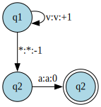
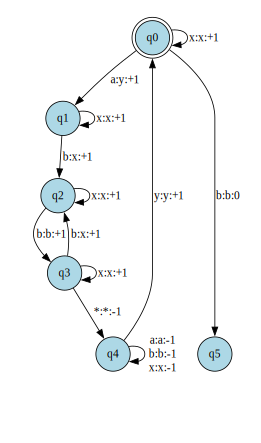

# Discreta II

## Clase Practica
### Maquinas de Turing

1 - Dada la siguiente maquina de turing, donde v pertenece al alfabeto de entrada:

a) Ejecutela sobre la secuencia 'abba'
b) Determine que lenguaje reconoce dicha maquina

2 - Dada las siguientes maquinas de turing determine que lenguaje reconocen
a)

**b)

3 - Para cada uno de estos lenguajes construya una maquina de turing que los reconozca\\
a) $0^{n}1^{n}$\\
*b) $ww^{R}$\\
c) Cualquier Lenguaje Regular\\
*d) Lenguaje de las cadenas Palindromas\\
*f) $1^{n}$ con $n$ primo

4 - Construya una maquina de turing cuya funcion sea:

a) Dado el Lenguaje L sobre las cadenas del alfabeto {a, b, c}, rote todos los caracteres a la derecha. Es decir todo los caracteres se mueven una posicion a la derecha excepto el ultimo que caeria en la primera posicion.

*b) Dado el Lenguaje L sobre las cadenas del alfabeto {a, b, c, d}, con forma $xd^n$, rote $x$ una cantidad $n$ de veces a la derecha, y que la salida solo contenga el resultado rotado, 
x = {a,b,c}\*.

*c) Computar $\left \lfloor \frac{a}{b} \right \rfloor$ en unario

5 - Construya una maquina de turing para computar \\
$g(x_1, x_2, ..., x_n) = min(x_1, x_2, ..., x_n)$. La entrada se codifica como $f(x_1, x_2, ..., x_n)$, ver CP 2.

6 - Demuestre que las siguientes maquinas son equivalentes a una maquina de turing:\\
a) Maquina de Turing Multipista\\
b) Maquina de Turing Multicinta\\
c) Maquina de Turing Bidimensional \\

