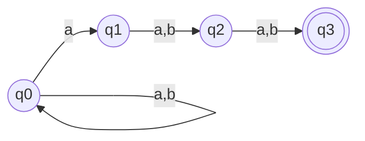
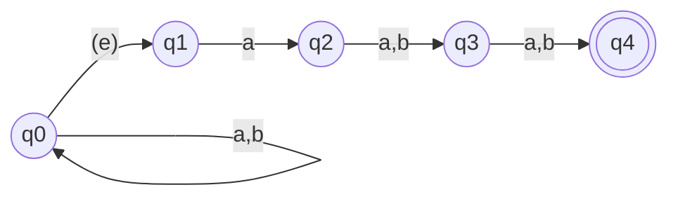
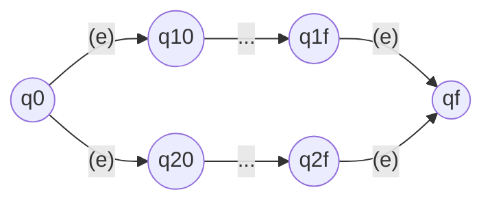

# Propiedades de los Lenguajes Regulares

- Definir autómata finito no determinista
- Demostración que no-determinista es equivalente a determinista
- Demostrar que los lenguajes regulares son cerrados bajo unión, complemento, intersección, y diferencia
- Enseñar la técnica de multiplicación de autómatas

## Autómata Finito No-Determinista

Ejemplo motivacional. Defina un autómata para el siguiente lenguaje:

> Cadenas sobre $\{a,b\}^*$ donde la antepenúltima letra es $a$.

El autómata para este lenguaje debe contemplar todas las posibles terminaciones de tres letras, y tener todas las transiciones para salir de esas terminaciones en caso de que no sea el fin de la cadena.

- `aaa` 
- `aab` 
- `aba`
- `abb` 
- `baa` 
- `bab` 
- `bba`
- `bbb` 

> Tratar de hacer en pizarra. Es horrible!

El problema está en el determinismo, es una restricción muy fuerte. Imaginemos ahora que el autómata tiene la posibilidad de escoger por qué camino machea una cadena de forma no-determinista.

En el autómata anterior, si interpretamos "reconoce" como "existe algún camino válido", entonces cualquier cadena que tenga la antepenúltima $a$ puede ser reconocida. 

Por otro lado, ver que si una cadena es reconocida, necesariamente tiene la antepenúltima letra $a$.

Entonces, con esto podemos demostrar que una cadena cualquiera que termine tenga una antepenúltima letra $a$ es reconocida en el autómata y cualquier cadena que sea reconocida en el autómata tiene una antepenúltima letra $a$.

### Formalizando

Vamos a formalizar esta noción de autómata finito no determinista. Recordemos la definición de autómata finito determinista. Vamos a ver qué es lo que tenemos que cambiar.

Tenemos que permitir de alguna manera que la función en esta permita más de una transición. Para eso hacemos que la función, en vez de tener como imagen un estado, tenga como imagen un conjunto de estados.

$$
f: V \times Q \rightarrow 2^Q
$$

Por otro lado, vamos a permitir otra cosa más. Vamos a permitir que de un estado se pueda pasar para otro cualquiera sin consumir ninguna letra. Lo vamos a llamar $\epsilon$-transiciones. Por ejemplo:

Eso nos cierta flexibilidad en decir estamos en un estado y a partir de ahora vamos a estar en otro, de forma no-determinista, sin consumir ningun símbolo. 

Y por último tenemos que modificar cómo se define el reconocimiento de autómatas. Recuerden que la vez pasada teníamos una secuencia de transiciones que coincidían con la cadena.

Ahora vamos a poder tener $\epsilon$-transiciones en esta secuencia, y podemos tener más de una secuencia que machee una cadena. Entonces vamos a decir que una cadena se reconoce si existe una secuencia de transiciones como la siguiente.

$$
<q_0,x_0> \ldots <q_i,x_i> \ldots <q_f, \$>
$$

Donde siempre ocurre lo siguiente:
- $x_i$ = $\epsilon$ , ó
- $x_i \in w$, y
- la subsecuencia $<q_i, x_i>$ donde $x_i \neq \epsilon$ es exactamente $w$

La restricción de la función de transición es casi igual, pero ahora en forma de conjunto (vean que ya contiene naturalmente las $\epsilon$-transiciones):

$$
q_{i+1} \in f(x_i,q_i)
$$

Y vamos a decir lo mismo, que el lenguaje reconocido por el automata no-determinista es exactamente equivalente al lenguaje de todas las cadenas para las cuales existe al menos un camino en ese sentido que termina en un estado final.

La pregunta sencilla ahora, entonces, es si los automatas finitos no deterministas definen una clase de lenguaje estrictamente superior a los lenguajes regulares.

> Piénsalo durante un segundo, a ver qué se te ocurre.

### ¿Qué lenguajes reconocen los NFA?

La respuesta es que los lenguajes finitos no deterministas definen exactamente el mismo conjunto de lenguaje que los finitos deterministas, es decir, los **Lenguajes Regulares**.

Esto es sorprendente porque, aparentemente, tienen más poder. Aparentemente, el no determinismo y las $\epsilon$-transiciones nos permiten expresar cosas mucho más flexibles que los lenguajes finitos deterministas. 

Pero, esta idea intuitiva que acabamos de ver —de que este lenguaje, con la antepenúltima $a$, es regular, lo que pasa es que tiene una cantidad exponencial de estados— nos debe dar una idea de por qué los automatas finitos no deterministas también representan lenguajes regulares.

La relación entre finitos no-deterministas y finitos deterministas va a ser que un automata finito no-determinista siempre puede convertirse en un automata finito determinista pero teniendo una cantidad exponencial de estados. O sea, vamos a intentar hacer una construcción de un automata determinista en la cual, cada vez que un automata finito no-determinista pueda estar en algún subconjunto posible de todos los estados, para cada subconjunto, haya un estado en el automata finito determinista que lo represente. De forma tal que podamos emular el comportamiento no-determinista como si fuera un backtrack a partir de simular a la vez todos los estados.

Vamos a hacer primero una demostración intuitiva de una construcción intuitiva para después ver cómo sucede en el caso general.

> Hacer la construcción intuitiva del DFA

Realmente en esta conferencia no nos va a dar tiempo a demostrar formalmente que esta construcción es correcta pero vamos a hacer un esbozo de la idea de la demostración para ponerlo en general y va a quedar para clase práctica, para estudio independiente, demostrar que esto es equivalente.

La idea de la construcción va a ser la siguiente. Vamos a inventarnos dos operaciones. Una operación se llama la **$\epsilon$-clausura** y otra operación se llama el **GOTO**.

- El GOTO de un conjunto de estados con un símbolo es el conjunto de estados para los cuales existe alguna transición con ese símbolo en alguno de los estados del conjunto original. 

Eso de cierta manera te dice, si yo estoy en este conjunto de estados y aparece un símbolo tipo A entonces puedo estar en cualquiera de este otro conjunto de estados.

La $\epsilon$-clausura es, dado un conjunto de estados, todos los estados alcanzables a partir solo de transiciones $\epsilon$.

> Esta se define recursivamente como todos los estados alcanzables a partir de transiciones $\epsilon$ y posteriormente la $\epsilon$ clausura de esos estados.

Una vez que tenemos estas dos operaciones el autómata finito terminista queda definido relativamente fácil.

El estado inicial es $\epsilon$- clausura de `q0`. Luego vamos a hacer por cada subconjunto de los estados del no-determinista, vamos a poner los $2^Q$ estados, por cada subconjunto vamos a hacer un nuevo estado. 
Y vamos a poner en ese estado una transición con el símbolo $x$ a otro estado, si y solo si este estado es $\epsilon$-clausura del estado anterior con el símbolo $x$.

> Este por supuesto no es un algoritmo de construcción, es simplemente una definición.

Y aquí va a quedar la cantidad exponencial de estados. Cuando haces el algoritmo de construcción y lo vas construyendo de manera dinámica no necesariamente te salen todos los subconjuntos, sino solo aquellos que son alcanzables.

> Ahora quedaría indicada la demostración de que son equivalentes para clases prácticas.

La idea de la demostración va a ser algo del estilo tratar de ver que si existe una cadena, dame un lenguaje cualquiera, dame cualquier cadena de ese lenguaje, si existe una secuencia de transiciones en el no-determinista que lo reconoce, entonces construir la secuencia de transiciones correspondiente en el determinista que lo reconoce y viceversa.

## De vuelta a los lenguajes regulares

Una vez que ya tenemos bien claro que los lenguajes regulares son equivalentes los automatas finitos no-deterministas, podemos replantear la definición del lenguaje regular, que siendo un lenguaje regular sí y solo sí existe un automata finito determinista o no-determinista que lo reconozca, sabiendo de que de no-determinista siempre puedo construir un determinista y el determinista siempre lo puedo hacer completamente especificado.

Esto va a ser útil, porque ahora para demostrar que un lenguaje es regular podemos hacer un automata finito no-determinista y decir, dame el automata finito determinista que le corresponde.

Por ejemplo, vamos a demostrar ahora que ciertas operaciones sobre el conjunto de los lenguajes regulares son también regulares. Vamos a demostrar que la unión, el complemento, la intersección, y la diferencia de lenguajes regulares son regulares.

Vamos a dejar para CP otras operaciones como la concatenación, el reverso, y la clausura.

### Técnica 1: Combinando autómatas

Vamos a demostrar que la unión de dos lenguajes regulares es regular. Y esto lo vamos a hacer a partir de la combinación de los automatas finitos no deterministas.

Sean L1 y L2 lenguajes regulares, si un lenguaje L1 es regular y L2 es regular, existe un automata finito determinista que los reconoce. Por tanto, dame el automata finito determinista de L1 y el automata finito determinista de L2.

Construye el siguiente autómata:

Aquí falta un detalle. ¿Quién garantiza que L1 y L2 tengan exactamente un estado final? Pues resulta que siempre puedo convertir un DFA en un NFA idéntico pero con un solo estado final. 

### Técnica 2: Modificando el autómata

Vamos a demostrar ahora  que el complemento de un automata en un lenguaje regular sobre el universo es también regular.

> Coge automata finito determinista que reconoce este lenguaje, y vamos a invertir el conjunto de estados finales.

¿Eso funciona? No, eso no funciona siempre porque el automata finito determinista tiene que estar completamente especificado. Pero si digo que está completamente especificado, entonces sí funciona.

### Técnica 3: Álgebra de conjuntos

Vamos a demostrar la intersección. Aplicando álgebra de conjuntos de tenemos que:

$$
L_1 \cap L_2 = \left( L_1^C \cup L_2^C \right)^C
$$
Entonces, la diferencia ¿cómo se hace?

$$
L_1 - L_2 = L_1 \cap L_2^C
$$

Parece trampa, ¿no? Pero noten que estas dos demostraciones son también constructivas, porque sabemos construir la unión y el complemento, así que para dos lenguajes concretos, aplicando esos pasos, nos saldrá algún autómata monstruoso pero correcto.

### Técnica 4: Multiplicación de autómatas

Vamos a intentar hacer el automata de la intercesión a partir de una técnica que se llama la técnica de multiplicación de automatas.

La técnica de multiplicación de automata nos permite construir un automata que combina, es la manera más poderosa de combinar dos automatas, cualquiera, para hacer algo que tiene que ver con la intercesión de esos lenguajes.

Vamos a coger, vamos a hacerla primero intuitivamente y después vamos a ver cómo se generaliza.

> Construcción intuitiva de la intersección en pizzara.

Para CP queda si dos lenguajes originales son regulares, demuestra que el `zip` de esos dos lenguajes también es regular.

La manera de hacerlo es construyendo un automata que lo reconozca, pero ya no va a ser tan fácil dónde poner las transiciones. Vas a tener que decir, dado que estoy en el automata 1, me va a hacer falta poner no solo los estados del producto cartesiano, sino una dimensión más quee rastree si estoy caminando en uno o si estoy caminando en el otro.

## Conclusiones

Hemos caracterizado los lenguajes regulares casi en su totalidad. Hemos dicho un lenguaje es regular si y solo si hay un automata finito determinista que lo reconoce, pero además hemos demostrado que hay un formalismo —que es el no determinista—, que es equivalente al determinista y la demostración es por construcción.

Pero además hemos visto que los lenguajes regulares son cerrados con respecto a la mayoría las operaciones entre conjuntos. Hemos dado 4 técnicas para demostrar que estas operaciones son regulares y básicamente casi cualquier cosa que tú hagas entre dos lenguajes regulares te va a dar un lenguaje regular.

Nos viene quedando la pregunta de, ¿hay algo que no sea regular? Esta es la pregunta que vamos a responder en la próxima conferencia.

Pero la idea intuitiva, evidentemente tiene que haber cosas que no sean regulares, si no, para qué queremos la máquina de Turing, ¿no? Entonces vamos a intentar encontrar el primer lenguaje, el lenguaje más sencillo posible que es no regular.

Y la idea clave va a estar en que estos automatas, como son finitos —tienen una cantidad de memoria finita—, no pueden contar hasta infinito.

Por tanto, si uno define un lenguaje donde haya que contar la cantidad exacta de letras que hay, por ejemplo, que la cantidad de A sea igual a la cantidad de B, ese lenguaje intuitivamente no va a poder ser regular porque no hay suficientes estados para contar todas las posibilidades.

Por tanto, en algún punto este lenguaje se le va a olvidar exactamente qué cadena es la que ha visto. Y, por tanto, va a tener que reconocer adicionalmente a esa otra inmensa cantidad de cadenas que se me salen del lenguaje que yo quería.

Esto vamos a ver en la conferencia que viene y vamos a ver el primer resultado limitante de teoría de lenguaje.
